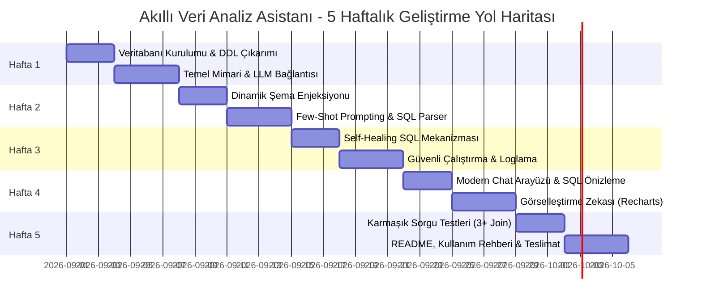

# 📊 Doğal Dil İşlemeli Akıllı Veri Analiz Asistanı
## 5 Haftalık Proje Çalışma ve Uygulama Planı (PRJIC20260202)

---

## 📌 Proje Genel Bilgileri

* **Proje Başlığı:** Doğal Dil İşlemeli Akıllı Veri Analiz Asistanı
* **Proje Numarası:** PRJIC20260202
* **Proje Süresi:** 5 Hafta
* **Temel Amaç:** Teknik bilgisi olmayan kullanıcıların doğal dil (Türkçe/İngilizce) ile karmaşık veritabanı sorguları yapmasını sağlamak; üretilen SQL'i güvenli biçimde çalıştırıp sonuçları dinamik tablo, KPI kartı ve grafiklerle sunmak.

---

## 🏗️ Sistem ve Teknoloji Mimarisi

```
+-----------------------------------------------------------------------------------+
|                                 KULLANICI ARAYÜZÜ                                 |
|         (React / Streamlit - Doğal Dil Sohbet, Dinamik Tablo, Recharts Grafik)    |
+------------------------------------------+----------------------------------------+
                                           | (HTTP / REST API)
                                           v
+-----------------------------------------------------------------------------------+
|                                 BACKEND API KATMANI                               |
|                     (Python FastAPI / .NET 8 ASP.NET Core)                        |
|                                                                                   |
|  +------------------------+  +--------------------------+  +-------------------+  |
|  | Schema Extractor &     |  | AI SQL Agent &           |  | SQL Parser &      |  |
|  | Metadata Dictionary    |  | Few-Shot Engine          |  | Security Filter   |  |
|  +------------------------+  +--------------------------+  +-------------------+  |
|                                                                                   |
|  +------------------------+  +--------------------------+  +-------------------+  |
|  | Self-Healing Engine    |  | Chart Decision Engine    |  | Audit & Log       |  |
|  | (Retry on DB Error)    |  | (Type & Distribution)    |  | Service           |  |
|  +------------------------+  +--------------------------+  +-------------------+  |
+------------------------------------------+----------------------------------------+
                                           | (Read-Only DB Connection)
                                           v
+-----------------------------------------------------------------------------------+
|                               VERİTABANI KATMANI                                  |
|         (PostgreSQL / MSSQL / SQLite - Northwind / Chinook Veritabanı)            |
+-----------------------------------------------------------------------------------+
```

---

## 📅 5 Haftalık Detaylı Çalışma Planı



---

### 🟢 1. HAFTA: Veritabanı Kurulumu, Şema Çıkarımı ve Temel Altyapı

* **Ana Hedef:** Örnek kurumsal veritabanının ayağa kaldırılması, şema çıkarım servisinin kodlanması ve temel API/LLM bağlantısının sağlanması.

#### Görevler:
1. **Veritabanı ve Şema Yapılandırması:**
   * PostgreSQL veya MSSQL üzerinde **Northwind** (veya Chinook) veritabanının kurulması (`Orders`, `OrderDetails`, `Customers`, `Employees`, `Products`, `Categories`, `Suppliers`).
   * Yalnızca `SELECT` yetkisine sahip **Read-Only** bir veritabanı kullanıcısının (`db_analyst_readonly`) oluşturulması.
2. **Metadata ve Şema Çıkarıcı Servisi (`SchemaExtractor`):**
   * Tablo isimlerini, kolon tiplerini, Primary Key (PK) ve Foreign Key (FK) ilişkilerini veritabanından dinamik okuyan mekanizmanın yazılması.
   * Tablo ve kolonlar için iş açıklamalarını (örneğin: `"UnitPrice": "Ürünün birim satış fiyatı"`) tutan bir metadata sözlüğü hazırlanması.
3. **Proje Çatısı ve LLM Entegrasyonu:**
   * n-Katmanlı mimari yapısının kurulması (Controller/Router -> Service -> Repository).
   * LLM API (OpenAI GPT-4o / Claude 3.5 Sonnet / Gemini API) bağlantı testlerinin tamamlanması.

#### Hafta 1 Teslim Edilecekler:
- [ ] Çalışır durumda Northwind veritabanı ve ER diyagramı dökümanı.
- [ ] Dinamik DDL/Şema çıkarıcı modül.
- [ ] LLM API bağlantı ve test scriptleri.

---

### 🟢 2. HAFTA: Doğal Dil -> SQL Çevirici Motoru (Text-to-SQL Engine)

* **Ana Hedef:** Doğal dildeki kullanıcı isteklerinden şemaya uygun, optimize ve güvenli SQL sorguları üreten Agent/Prompt boru hattının (pipeline) kurulması.

#### Görevler:
1. **Dinamik Şema Enjeksiyonu (Schema Context Prompting):**
   * Kullanıcının sorusuna göre ilgili tablo şemalarını ve ilişkileri LLM promptuna dinamik olarak enjekte eden yapının kurulması.
   * Token tasarrufu ve doğruluk için tablo filtreleme (Table Pruning) altyapısının tasarlanması.
2. **Few-Shot Prompting Kütüphanesi:**
   * Türkçe ve İngilizce soru kalıplarını içeren en az 15 adet örnek soru-SQL eşleşmesinin sisteme eklenmesi:
     * *Örnek:* "2024 yılında en çok satış yapan 5 personel kim?" $\rightarrow$ `SELECT e.FirstName, e.LastName, SUM(...) ...`
     * *Örnek:* "Hiç sipariş vermemiş müşteriler hangileri?" $\rightarrow$ `LEFT JOIN` / `NOT EXISTS` kurgusu.
3. **SQL Parser ve Güvenlik Doğrulayıcı Katman:**
   * Üretilen çıktı içerisinden saf SQL kodunu ayıran parser yazılması.
   * `DROP`, `DELETE`, `INSERT`, `UPDATE`, `ALTER`, `TRUNCATE`, `EXEC` gibi zararlı veya veri değiştiren komutların AST (Abstract Syntax Tree) / Regex ile engellenmesi.

#### Hafta 2 Teslim Edilecekler:
- [ ] Dinamik Şema Enjeksiyonlu Text-to-SQL modülü.
- [ ] Few-Shot Prompt şablonları kütüphanesi.
- [ ] SQL Injection ve Güvenlik Filtresi (Security Validator).

---

### 🟢 3. HAFTA: Self-Healing SQL, Güvenli Yürütme ve Loglama

* **Ana Hedef:** Hata veren SQL'lerin LLM tarafından kendi kendini onarması, güvenli çalıştırma motoru ve audit loglama altyapısı.

#### Görevler:
1. **Self-Healing (Kendi Kendini Tamir Eden) SQL Mekanizması:**
   * Veritabanından syntax hatası, yanlış kolon adı veya join hatası döndüğünde:
     * `[Hata Mesajı] + [Hatalı SQL] + [İlgili Şema]` bilgisi tekrar LLM'e beslenir.
     * LLM hatayı düzelterek yeni sorgu üretir (Maksimum 2-3 yeniden deneme döngüsü).
2. **Query Execution Engine:**
   * Sorguların Read-Only kullanıcıyla çalıştırılması.
   * Sorgu çalıştırma süresi sınırı (Timeout: 5 sn) ve maksimum satır limiti (`LIMIT 500` / `TOP 500`) eklenmesi.
3. **Kullanıcı Yönetimi ve Loglama (Audit Logging):**
   * Loglama tablosu (`QueryLogs`) tasarımı:
     * `ID`, `UserId`, `NaturalLanguageQuery`, `GeneratedSQL`, `ExecutionTimeMs`, `IsSuccess`, `ErrorMessage`, `RetryCount`, `CreatedAt`.
   * Başarılı ve başarısız sorguların istatistiklerinin tutulması.

#### Hafta 3 Teslim Edilecekler:
- [ ] Self-Healing SQL hata düzeltme servisi.
- [ ] Güvenli SQL Execution Engine (Limit & Timeout korumalı).
- [ ] Veritabanı sorgu loglama ve hata takip sistemi.

---

### 🟢 4. HAFTA: Dinamik Görselleştirme Motoru ve Modern Ön Yüz

* **Ana Hedef:** Kullanıcı dostu modern sohbet arayüzü, dinamik veri tabloları ve dönen verinin yapısına göre otomatik grafik türü belirleyen görselleştirme zekası.

#### Görevler:
1. **Görselleştirme Zekası (Chart Decision Engine):**
   * Dönen verinin kolon tipleri ve veri dağılımını analiz ederek en uygun görseli otomatik seçme:
     * **Tarih + Sayısal Metrik:** $\rightarrow$ **Line Chart (Çizgi Grafik)** (Aylık/Yıllık trendler).
     * **Kategori + Sayısal Metrik (5-15 öğe):** $\rightarrow$ **Bar / Column Chart (Sütun Grafik)** (Personel/Ürün satışları).
     * **Dağılım / Pay (3-7 öğe):** $\rightarrow$ **Pie / Donut Chart (Pasta Grafik)** (Kategori bazlı ciro dağılımı).
     * **Tek Satır / Tek Değer:** $\rightarrow$ **KPI Metric Card** (Toplam ciro, toplam sipariş adedi).
     * **Çok Kolonlu / Detaylı Liste:** $\rightarrow$ **Dinamik Veri Tablosu**.
2. **Frontend Arayüz Bileşenleri:**
   * **Sorgu Paneli (Chat UI):** Doğal dil giriş kutusu, hızlı örnek sorgu önerileri ("En çok satan 5 ürün", vb.).
   * **Sorgu Önizleme Modülü:** Çalıştırılan SQL kodunu görüntüleme ve kopyalama sekmesi.
   * **Veri Tablosu:** Sıralama, arama, sayfalama ve CSV/Excel export özellikleri.
   * **Grafik Alanı:** Recharts / Chart.js ile interaktif ve animasyonlu görselleştirme.
   * **Şema İzleyici Ekranı (Admin View):** Sistemin bildiği tabloları ve açıklamalarını listeleyen şema paneli.

#### Hafta 4 Teslim Edilecekler:
- [ ] Otomatik grafik türü belirleyici ve görselleştirme motoru.
- [ ] Modern, responsive Chat & Dashboard arayüzü.
- [ ] SQL önizleme, veri tablosu ve şema izleyici ekranları.

---

### 🟢 5. HAFTA: İleri Düzey Senaryolar, Testler, Optimizasyon ve Teslimat

* **Ana Hedef:** En az 3 tablolu karmaşık sorgu testlerinin yapılması, Spider benchmark doğrulaması, dökümantasyon ve nihai teslimat.

#### Görevler:
1. **Karmaşık JOIN ve Agregasyon Testleri:**
   * En az 3 tablolu karmaşık Türkçe sorgu senaryolarının test edilmesi:
     * *"2024 yılında en çok sipariş veren ilk 3 müşterinin en sık aldığı ürün kategorileri nelerdir?"* (`Customers` + `Orders` + `OrderDetails` + `Products` + `Categories`).
     * *"Hangi kargo şirketi ile taşınan siparişlerde ortalama teslimat süresi en kısadır?"* (`Shippers` + `Orders`).
2. **Performans ve Token Optimizasyonu:**
   * Metadata'nın önbelleğe (Cache) alınması.
   * Token maliyetini minimize eden prompt sıkıştırma yöntemlerinin uygulanması.
3. **Dökümantasyon ve Teslimat:**
   * `README.md`: Mimari diyagram, kurulum adımları ve `.env` yapılandırması.
   * **"Hangi Tabloları Sorgulayabilirim?" Rehberi:** Modelin desteklediği tablo ve sorgu yeteneklerinin dökümante edilmesi.
   * Dockerfile ve `docker-compose.yml` ile tek komutta ayağa kalkabilir hale getirilmesi.

#### Hafta 5 Teslim Edilecekler:
- [ ] 3+ tablolu karmaşık sorgu test raporları.
- [ ] GitLab/GitHub deposu (Kapsamlı README ve Kullanım Rehberi).
- [ ] Dockerize edilmiş, çalışmaya hazır proje ve demo kayıtları.

---

## 🎯 Proje Başarı ve Tamamlanma Kriterleri Kontrol Listesi

| Kriter | Açıklama | Durum |
| :--- | :--- | :---: |
| **Şema Enjeksiyonu** | Tablolar, kolonlar ve FK ilişkileri dinamik olarak LLM context'ine aktarılıyor mu? | ⏳ |
| **SQL Güvenliği** | Read-Only DB kullanıcısı + DROP/DELETE engelleyici parser devrede mi? | ⏳ |
| **Self-Healing** | Hatalı üretilen SQL sorguları LLM tarafından otomatik tamir ediliyor mu? | ⏳ |
| **Görselleştirme Zekası** | Veri tipine göre uygun grafik (Line, Bar, Pie, KPI) otomatik seçiliyor mu? | ⏳ |
| **3+ Tablolu JOIN Başarısı** | Çoklu tablo ilişkisi gerektiren karmaşık sorgular doğru sonuç üretiyor mu? | ⏳ |
| **Dökümantasyon** | README.md ve "Hangi Tabloları Sorgulayabilirim?" rehberi hazırlandı mı? | ⏳ |

---
*Planlama Tarihi: 2026-08-27 | Proje Kodu: PRJIC20260202*
