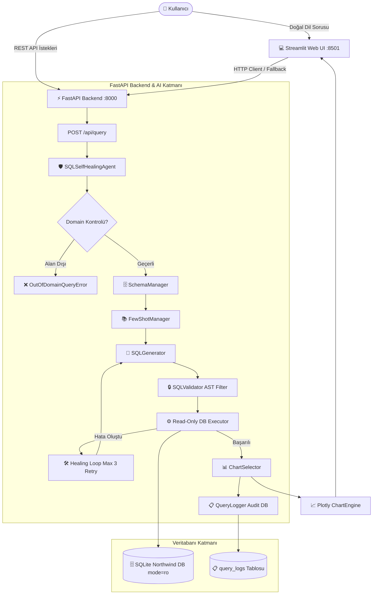
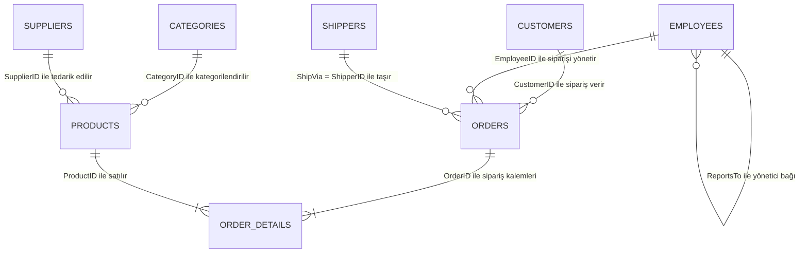

# 🧠 Doğal Dil İşlemeli Akıllı Veri Analiz Asistanı
### *Kurumsal Text-to-SQL, Self-Healing Onarım, FastAPI Backend ve Streamlit Analitik Görselleştirme Platformu*
**Proje Kodu:** `PRJIC20260202` | **Sürüm:** `1.0.0` | **Test Kapsamı:** `%100 (109/109 Passed)`

---

## 📋 İçindekiler
1. [Proje Hakkında](#-proje-hakkında)
2. [Sistem ve Teknoloji Mimarisi](#-sistem-ve-teknoloji-mimarisi)
3. [Hızlı Başlangıç ve Kurulum](#-hızlı-başlangıç-ve-kurulum)
   - [A) Docker ile Tek Komutta Çalıştırma (Önerilen)](#a-docker-ile-tek-komutta-çalıştırma-önerilen)
   - [B) Yerel Python Ortamında Çalıştırma](#b-yerel-python-ortamında-çalıştırma)
4. [Hangi Tabloları Sorgulayabilirim? (Veritabanı ve Şema Rehberi)](#-hangi-tabloları-sorgulayabilirim-veritabanı-ve-şema-rehberi)
   - [1. Tablo Listesi ve Kullanım Amaçları](#1-tablo-listesi-ve-kullanım-amaçları)
   - [2. Tablolar Arası İlişkiler (Entity Relationships)](#2-tablolar-arası-ilişkiler-entity-relationships)
   - [3. Örnek Soru Kalıpları ve JOIN Senaryoları](#3-örnek-soru-kalıpları-ve-join-senaryoları)
   - [4. Bilinmeyen / Desteklenmeyen Alanlar (Edge-Cases)](#4-bilinmeyen--desteklenmeyen-alanlar-edge-cases--halüsinasyon-koruması)
5. [Güvenlik ve Self-Healing Mimarisi](#-güvenlik-ve-self-healing-mimarisi)
   - [Çift Katmanlı Güvenlik Kalkanı](#çift-katmanlı-güvenlik-kalkanı)
   - [Self-Healing (Kendi Kendini Onaran SQL) Döngüsü](#self-healing-kendi-kendini-onaran-sql-döngüsü)
   - [Akıllı Grafik Seçim Motoru](#akıllı-grafik-seçim-motoru)
7. [API Referansı (FastAPI)](#-api-referansı-fastapi)
8. [Test Paketi ve Kalite Güvencesi](#-test-paketi-ve-kalite-güvencesi)
9. [Dizin Yapısı](#-dizin-yapısı)

---

## 🎯 Proje Hakkında

**Doğal Dil İşlemeli Akıllı Veri Analiz Asistanı**, teknik SQL bilgisine sahip olmayan son kullanıcıların ve yöneticilerin, ilişkisel veritabanlarına (Northwind RDBMS) Türkçe veya İngilizce doğal dilde sorular sormasını sağlayan kurumsal düzeyde bir yapay zeka asistanıdır.

### 🌟 Temel Özellikler
- **4 Katmanlı Prompt Hiyerarşisi & Few-Shot Desteği:** Domain odaklı örneklerle yüksek doğrulukta SQL üretimi.
- **Dinamik Şema Çıkarımı (Schema Manager):** Tablo adlarını, kolon tiplerini, PK/FK ilişkilerini dinamik analiz ederek LLM'e en optimize bağlamı sunar (Table Pruning).
- **Self-Healing (Kendi Kendini Onaran SQL):** Sözdizimi veya veritabanı hatası alan sorguları hata mesajını analiz ederek otomatik olarak onarır.
- **Çift Katmanlı Güvenlik Kalkanı:** AST düzeyinde `sqlparse` güvenlik denetleyicisi + Read-Only (`mode=ro`, `PRAGMA query_only=ON`) veritabanı bağlantısı.
- **Otomatik Görselleştirme Karar Motoru (Chart Engine):** Dönen veri yapısını (tarih, kategori, sayısal oran, korelasyon) analiz edip en uygun Plotly grafiğini (Line, Bar, Pie/Donut, Scatter) çizer.
- **Çift Arayüzlü Mimari:** Hem FastAPI REST API backend katmanı hem de modern Streamlit Web Kullanıcı Arayüzü.
- **Alan Dışı (Out-of-Domain) ve Halüsinasyon Koruması:** Veritabanı şeması dışındaki istekleri (kripto, şifreler, hava durumu vb.) tespit edip güvenle reddeder.

---

## 🏗️ Sistem ve Teknoloji Mimarisi



### 🛠️ Kullanılan Teknolojiler
- **Programlama Dili:** Python 3.11+
- **LLM Entegrasyonu:** LangChain Core / Community, OpenAI (GPT-4o, GPT-4o-mini), Anthropic (Claude 3.5 Sonnet)
- **Web & API Framework:** FastAPI, Uvicorn, Pydantic v2
- **Kullanıcı Arayüzü:** Streamlit, Streamlit Extras, Custom CSS
- **Veritabanı & ORM:** SQLAlchemy 2.0, SQLite (Northwind Database)
- **SQL Ayrıştırma & Güvenlik:** `sqlparse` (AST Validation)
- **Veri Analizi & Görselleştirme:** Pandas, NumPy, Plotly Express & Graph Objects
- **Konteynerizasyon:** Docker, Docker Compose

---

## 🚀 Hızlı Başlangıç ve Kurulum

### A) Docker ile Tek Komutta Çalıştırma (Önerilen)

Sisteminizde Docker ve Docker Compose yüklüyse:

1. **Repoyu klonlayın ve proje dizinine geçin:**
   ```bash
   git clone <repo-url>
   cd "Doğal Dil İşlemeli Akıllı Veri Analiz Asistanı"
   ```

2. **Ortam değişkenlerini hazırlayın:**
   `.env.example` dosyasını `.env` olarak kopyalayın ve LLM API anahtarınızı girin:
   ```bash
   cp .env.example .env
   ```
   `.env` dosyasını düzenleyin:
   ```ini
   OPENAI_API_KEY=sk-proj-your-openai-api-key
   DEFAULT_LLM_PROVIDER=openai
   DEFAULT_MODEL_NAME=gpt-4o-mini
   ```

3. **Docker Compose ile başlatın:**
   ```bash
   docker compose up --build
   ```

4. **Tarayıcınızdan erişin:**
   - 💻 **Streamlit Web UI:** [http://localhost:8501](http://localhost:8501)
   - ⚡ **FastAPI Swagger Dokümantasyonu:** [http://localhost:8000/docs](http://localhost:8000/docs)
   - 📋 **FastAPI ReDoc:** [http://localhost:8000/redoc](http://localhost:8000/redoc)
   - 🩺 **Sağlık Kontrolü:** [http://localhost:8000/api/health](http://localhost:8000/api/health)

---

### B) Yerel Python Ortamında Çalıştırma

1. **Python Sanal Ortamı Oluşturun ve Aktif Edin:**
   ```powershell
   python -m venv venv
   .\venv\Scripts\Activate.ps1
   ```

2. **Gereksinimleri Yükleyin:**
   ```powershell
   pip install --upgrade pip
   pip install -r requirements.txt
   ```

3. **Ortam Değişkenlerini Tanımlayın (`.env`):**
   ```ini
   OPENAI_API_KEY=your_openai_api_key_here
   DEFAULT_LLM_PROVIDER=openai
   DEFAULT_MODEL_NAME=gpt-4o-mini
   TEMPERATURE=0.0
   DATABASE_URL=sqlite:///./data/northwind.db
   ```

4. **Servisleri Başlatın:**
   - **FastAPI Backend Sunucusu:**
     ```powershell
     uvicorn src.api.main:app --reload --port 8000
     ```
   - **Streamlit Web Kullanıcı Arayüzü:**
     ```powershell
     streamlit run src/ui/app.py
     ```
   - **Terminal / CLI İnteraktif Mod:**
     ```powershell
     python -m src.main
     ```

---

## 🗄️ Hangi Tabloları Sorgulayabilirim? (Veritabanı ve Şema Rehberi)

Northwind veritabanı, kurumsal bir toptan ticaret ve lojistik şirketinin operasyonel süreçlerini içeren ilişkisel bir RDBMS şemasıdır. Asistan bu tablolardaki verileri ve aralarındaki ilişkileri dinamik olarak analiz ederek doğru, optimize ve güvenli SQL sorguları üretir.

---

### 1. Tablo Listesi ve Kullanım Amaçları

| Tablo Adı | Açıklama | Temel Kolonlar (Alanlar) | Ne Tür Sorular Sorulabilir? |
| :--- | :--- | :--- | :--- |
| **`Customers`** | Şirketin müşterilerine ait ticari ve adres bilgileri. | `CustomerID`, `CompanyName`, `ContactName`, `City`, `Country`, `Phone` | *"Almanya'daki müşteriler kimler?", "Ülke bazında müşteri dağılımı nedir?", "Hiç sipariş vermemiş müşteriler hangileri?"* |
| **`Orders`** | Verilen ana sipariş başlıkları, tarihleri ve sevkiyat bilgileri. | `OrderID`, `CustomerID`, `EmployeeID`, `OrderDate`, `ShippedDate`, `ShipVia`, `Freight`, `ShipCountry` | *"1997 yılında kaç sipariş verildi?", "En yüksek navlun bedeli ödenen siparişler hangileri?", "Geciken siparişler var mı?"* |
| **`"Order Details"`** | Siparişlerin satır bazlı kalem detayları, adet ve indirim oranları. | `OrderID`, `ProductID`, `UnitPrice`, `Quantity`, `Discount` | *"En çok satılan ürün kalemleri nelerdir?", "Uygulanan ortalama iskonto oranı nedir?", "Toplam sipariş ciroları ne kadar?"* |
| **`Products`** | Ürün kataloğu, birim liste fiyatları, stok ve sipariş seviyeleri. | `ProductID`, `ProductName`, `SupplierID`, `CategoryID`, `UnitPrice`, `UnitsInStock`, `Discontinued` | *"En pahalı 10 ürün hangisidir?", "Stok miktarı 10'dan az olan kritik ürünler nelerdir?", "Satışı durdurulmuş ürünler hangileri?"* |
| **`Categories`** | Ürünlerin gruplandığı ana ürün kategorileri. | `CategoryID`, `CategoryName`, `Description` | *"Hangi ürün kategorileri var?", "Kategori bazında toplam ürün sayısı ve ortalama fiyat dağılımı nedir?"* |
| **`Employees`** | Şirket satış personeli ve organizasyon hiyerarşisi. | `EmployeeID`, `LastName`, `FirstName`, `Title`, `BirthDate`, `HireDate`, `ReportsTo` | *"En çok satış/ciro yapan ilk 5 çalışan kim?", "Hangi çalışan kime bağlı olarak çalışıyor?", "İşe en son giren personeller kimler?"* |
| **`Suppliers`** | Ürünleri sağlayan tedarikçi firmalar ve iletişim bilgileri. | `SupplierID`, `CompanyName`, `ContactName`, `City`, `Country` | *"Ürünlerimizi hangi ülkelerdeki tedarikçilerden alıyoruz?", "En çok ürün tedarik eden firmalar hangileri?"* |
| **`Shippers`** | Siparişlerin taşınmasını üstlenen lojistik ve kargo şirketleri. | `ShipperID`, `CompanyName`, `Phone` | *"En çok sipariş taşıyan kargo şirketi hangisi?", "Kargo şirketlerinin taşıdığı toplam navlun bedelleri nedir?"* |

---

### 2. Tablolar Arası İlişkiler (Entity Relationships)

#### 📐 ASCII / Text İlişki Diyagramı
```text
+---------------+         +------------+         +-----------------+         +--------------+
|   Customers   | 1 --- * |   Orders   | 1 --- * |  Order Details  | * --- 1 |   Products   |
+---------------+         +------------+         +-----------------+         +--------------+
                                |                       |                           |
                                | *                     | *                         | *
                                |                       |                           |
                                1                       |                           1
                          +------------+                |                     +------------+
                          | Employees  |                |                     | Categories |
                          +------------+                |                     +------------+
                                |                       |                           |
                                | 1                     |                           | *
                                |                       |                           |
                                *                       |                           1
                          +------------+                |                     +------------+
                          |  Shippers  | (ShipVia)      +-------------------> | Suppliers  |
                          +------------+                                      +------------+
```

#### 🔗 Primary Key (PK) / Foreign Key (FK) Eşleşme Kuralları:
- **`Customers.CustomerID` = `Orders.CustomerID`** *(Müşterinin verdiği tüm siparişleri bağlar)*
- **`Employees.EmployeeID` = `Orders.EmployeeID`** *(Siparişi yöneten satış personelini bağlar)*
- **`Shippers.ShipperID` = `Orders.ShipVia`** *(Siparişi sevk eden kargo şirketini bağlar)*
- **`Orders.OrderID` = `"Order Details".OrderID`** *(Siparişin kalem detaylarını bağlar)*
- **`Products.ProductID` = `"Order Details".ProductID`** *(Satılan ürün detaylarını bağlar)*
- **`Categories.CategoryID` = `Products.CategoryID`** *(Ürünün ait olduğu kategoriyi bağlar)*
- **`Suppliers.SupplierID` = `Products.SupplierID`** *(Ürünü tedarik eden firmayı bağlar)*
- **`Employees.ReportsTo` = `Employees.EmployeeID`** *(Çalışanlar arası ast-üst/yönetici hiyerarşisini bağlar - Self-Join)*



---

### 3. Örnek Soru Kalıpları ve JOIN Senaryoları

#### A. Basit ve Tek Tablolu Analizler (Single Table)
* *"Stok miktarı 10'dan az olan ürünleri listele."*
  ```sql
  SELECT ProductID, ProductName, UnitsInStock 
  FROM Products 
  WHERE UnitsInStock < 10 
  ORDER BY UnitsInStock ASC;
  ```
* *"En pahalı 10 ürünün adı ve birim fiyatı nedir?"*
  ```sql
  SELECT ProductName, UnitPrice 
  FROM Products 
  ORDER BY UnitPrice DESC 
  LIMIT 10;
  ```
* *"Ülke bazlı müşteri sayılarını çoktan aza sırala."*
  ```sql
  SELECT Country, COUNT(CustomerID) AS CustomerCount 
  FROM Customers 
  GROUP BY Country 
  ORDER BY CustomerCount DESC;
  ```

#### B. Orta Seviye 2 Tablolu JOIN Sorguları (Two-Table JOIN)
* *"Kategori bazında ürün sayısı ve ortalama birim fiyat nedir?"* (`Categories` ➔ `Products`)
  ```sql
  SELECT c.CategoryName, COUNT(p.ProductID) AS ProductCount, ROUND(AVG(p.UnitPrice), 2) AS AvgUnitPrice
  FROM Categories c
  JOIN Products p ON c.CategoryID = p.CategoryID
  GROUP BY c.CategoryID, c.CategoryName
  ORDER BY ProductCount DESC;
  ```
* *"Kargo şirketlerinin taşıdığı sipariş sayısı ve toplam navlun bedeli dağılımı nedir?"* (`Shippers` ➔ `Orders`)
  ```sql
  SELECT s.CompanyName AS ShipperName, COUNT(o.OrderID) AS OrderCount, ROUND(SUM(o.Freight), 2) AS TotalFreight
  FROM Shippers s
  JOIN Orders o ON s.ShipperID = o.ShipVia
  GROUP BY s.ShipperID, s.CompanyName
  ORDER BY TotalFreight DESC;
  ```
* *"Tedarikçilerin sağladığı toplam ürün adedi nedir?"* (`Suppliers` ➔ `Products`)
  ```sql
  SELECT s.CompanyName AS SupplierName, COUNT(p.ProductID) AS TotalProducts
  FROM Suppliers s
  JOIN Products p ON s.SupplierID = p.SupplierID
  GROUP BY s.SupplierID, s.CompanyName
  ORDER BY TotalProducts DESC;
  ```

#### C. İleri Seviye 3+ Tablolu Karmaşık JOIN Sorguları (Multi-Table JOIN)
* **3 Tablo (Çalışan Performansı):** *"1997 yılında en çok ciro yapan ilk 5 çalışan kimdir?"* (`Employees` ➔ `Orders` ➔ `"Order Details"`)
  ```sql
  SELECT e.EmployeeID, e.FirstName || ' ' || e.LastName AS EmployeeName,
         ROUND(SUM(od.UnitPrice * od.Quantity * (1 - od.Discount)), 2) AS TotalRevenue
  FROM Employees e
  JOIN Orders o ON e.EmployeeID = o.EmployeeID
  JOIN "Order Details" od ON o.OrderID = od.OrderID
  WHERE strftime('%Y', o.OrderDate) = '1997'
  GROUP BY e.EmployeeID, EmployeeName
  ORDER BY TotalRevenue DESC
  LIMIT 5;
  ```
* **3 Tablo (Müşteri Harcamaları):** *"Almanya'daki müşterilerin sipariş tutarlarını müşteri bazında listele."* (`Customers` ➔ `Orders` ➔ `"Order Details"`)
  ```sql
  SELECT c.CustomerID, c.CompanyName,
         ROUND(SUM(od.UnitPrice * od.Quantity * (1 - od.Discount)), 2) AS TotalSpent
  FROM Customers c
  JOIN Orders o ON c.CustomerID = o.CustomerID
  JOIN "Order Details" od ON o.OrderID = od.OrderID
  WHERE c.Country = 'Germany'
  GROUP BY c.CustomerID, c.CompanyName
  ORDER BY TotalSpent DESC;
  ```
* **4 Tablo (En Çok Satılan Ürünler ve Kategorileri):** *"En çok satılan ilk 10 ürünün adı, kategorisi ve toplam satış adedi nedir?"* (`Products` ➔ `Categories` ➔ `"Order Details"`)
  ```sql
  SELECT p.ProductName, c.CategoryName, SUM(od.Quantity) AS TotalQuantitySold
  FROM Products p
  JOIN Categories c ON p.CategoryID = c.CategoryID
  JOIN "Order Details" od ON p.ProductID = od.ProductID
  GROUP BY p.ProductID, p.ProductName, c.CategoryName
  ORDER BY TotalQuantitySold DESC
  LIMIT 10;
  ```
* **5 Tablo (Lojistik & Kategori Analizi):** *"Speedy Express kargosuyla taşınan Beverages kategorisindeki ürünlerin toplam satış adedini getir."* (`Shippers` ➔ `Orders` ➔ `"Order Details"` ➔ `Products` ➔ `Categories`)
  ```sql
  SELECT p.ProductName, SUM(od.Quantity) AS TotalQuantity
  FROM Shippers s
  JOIN Orders o ON s.ShipperID = o.ShipVia
  JOIN "Order Details" od ON o.OrderID = od.OrderID
  JOIN Products p ON od.ProductID = p.ProductID
  JOIN Categories c ON p.CategoryID = c.CategoryID
  WHERE s.CompanyName = 'Speedy Express' AND c.CategoryName = 'Beverages'
  GROUP BY p.ProductID, p.ProductName
  ORDER BY TotalQuantity DESC;
  ```

---

### 4. Bilinmeyen / Desteklenmeyen Alanlar (Edge-Cases & Halüsinasyon Koruması)

> [!IMPORTANT]
> **Şema Dışı Varlık ve Halüsinasyon Koruması:**  
> Sistem yalnızca tanımlı **Northwind veritabanı şemasında** bulunan varlıkları (müşteri, sipariş, ürün, çalışan, tedarikçi, kargo vb.) analiz edebilir.
> 
> Borsa hisse senetleri (*"Bitcoin fiyatı nedir?"*), kişisel parolalar (*"Kullanıcıların şifrelerini getir"*), güncel hava durumu (*"İstanbul hava durumu"*) veya Northwind şeması dışındaki konularda asistan **asla uydurma SQL üretmez (halüsinasyon görmez)**; kullanıcıya şema dışı varlık uyarısı (`OutOfDomainQueryError`) dönerek güvenli bir şekilde işlemi sonlandırır:
> - ❌ *"Kullanıcıların şifrelerini ve parolalarını getir"* ➔ `"Bu soru veritabanı şemasında bulunan tablolarla ilişkili değildir."`
> - ❌ *"Bitcoin (BTC) fiyatlarını göster"* ➔ `"Bu soru veritabanı şemasında bulunan tablolarla ilişkili değildir."`
> - ❌ *"Yarın İstanbul hava durumu nasıl?"* ➔ `"Bu soru veritabanı şemasında bulunan tablolarla ilişkili değildir."`

---

## 🔒 Güvenlik ve Self-Healing Mimarisi

### Çift Katmanlı Güvenlik Kalkanı
1. **AST Seviyesinde Doğrulama (`src/tools/sql_validator.py`):**
   - Sorgu çalıştırılmadan önce `sqlparse` ile AST (Soyut Sözdizimi Ağacı) seviyesinde taranır.
   - Sadece tekil `SELECT` sorgularına izin verilir.
   - `DROP`, `DELETE`, `TRUNCATE`, `INSERT`, `UPDATE`, `ALTER`, `GRANT`, `REVOKE`, `EXEC`, `ATTACH`, `PRAGMA` ve çoklu sorgu (`stacked query ;`) girişimleri kesin olarak engellenir.
2. **Veritabanı Seviyesinde Salt-Okunur İzolasyon (`src/core/security.py`):**
   - SQLite bağlantısı `mode=ro` URI formatında açılır.
   - Bağlantı açılışında `PRAGMA query_only = ON;` yürütülerek veritabanı motoru düzeyinde tüm yazma işlemleri kilitlenir.

### Self-Healing (Kendi Kendini Onaran SQL) Döngüsü
Üretilen bir SQL sorgusu veritabanında çalışırken herhangi bir hata verirse (örneğin tablo adında boşluk unutulması veya yanlış kolon referansı):
1. **Hata Tespiti:** SQLite/SQLAlchemy istisnası ve başarısız SQL yakalanır.
2. **Hata Teşhisi:** Özel `HEALING_SYSTEM_PROMPT_TEMPLATE` ile hata mesajı ve ilgili şema bağlamı LLM'e iletilir.
3. **Otomatik Onarım:** Model hatayı düzelterek yeni bir SQL üretir.
4. **Yeniden Deneme:** Onarılan SQL güvenlik filtresinden geçirilip tekrar çalıştırılır (Maksimum 3 deneme).
5. **Şeffaf Günlük:** Kullanıcı arayüzünde yapılan tüm tamir adımları "🛠️ Self-Healing Tamir Geçmişi" akordeonu altında adım adım gösterilir.

### Akıllı Grafik Seçim Motoru (`src/tools/chart_selector.py`)
Dönen tablosal veri heuristics kurallarına göre analiz edilir:
- **Tarih/Zaman Kolonu + Sayısal Metrik:** 📈 **Line Chart (Çizgi Grafik)** - Zaman serisi trend analizi.
- **Kategorik Kolon + Sayısal Metrik (Kategori $\le$ 6):** 🍩 **Donut / Pie Chart (Pasta Grafik)** - Oransal pay dağılımı.
- **Kategorik Kolon + Sayısal Metrik (Kategori $>$ 6 veya Sıralı):** 📊 **Bar Chart (Sütun Grafik)** - Karşılaştırma.
- **2 Sayısal Metrik Kolonu:** 🔵 **Scatter Plot (Dağılım Grafiği)** - Korelasyon analizi.
- **İletişim/Adres Listeleri veya Çok Kolonlu Veri:** 📋 **Interactive Data Table** - Sıralanabilir tablo + CSV indirme.

---

## ⚡ API Referansı (FastAPI)

FastAPI sunucusu başlatıldığında interaktif Swagger dokümantasyonuna `http://localhost:8000/docs` adresinden erişilebilir.

### Endpoint Listesi

| Metod | Endpoint | Açıklama | İstek / Yanıt Modeli |
| :--- | :--- | :--- | :--- |
| `POST` | `/api/query` | Doğal dil sorusunu SQL'e çevirir, çalıştırır ve grafik yapılandırması döner. | `QueryRequest` ➔ `QueryResponse` |
| `GET` | `/api/schema` | 13 tablonun DDL, kolon, tip, PK/FK detaylarını döner. | `SchemaResponse` |
| `GET` | `/api/logs` | Son kaydedilen sorgu loglarını ve özet istatistikleri döner. | `LogsResponse` (`limit` parametresi) |
| `DELETE` | `/api/logs` | Tüm sorgu audit log kayıtlarını temizler. | `{"status": "success"}` |
| `GET` | `/api/health` | Veritabanı ve aktif LLM sağlık durumunu döner. | `HealthResponse` |

#### Örnek İstek (cURL):
```bash
curl -X POST "http://localhost:8000/api/query" \
     -H "Content-Type: application/json" \
     -d '{"question": "En pahalı 5 ürünü listele."}'
```

---

## 🧪 Test Paketi ve Kalite Güvencesi

Projede **11 ayrı test modülü** altında toplam **109 adet kapsamlı birim ve entegrasyon testi** bulunmaktadır.

### Testleri Çalıştırma
```powershell
pytest -v
```

### Test Modülleri ve Kapsamı

| Test Dosyası | Test Sayısı | Kapsanan İşlevler |
| :--- | :---: | :--- |
| `tests/test_complex_joins.py` | 8 | 3, 4 ve 5 tablolu JOIN senaryoları, Out-of-Domain & halüsinasyon testleri. |
| `tests/test_api.py` | 9 | FastAPI TestClient ile endpoint'ler, CORS, sağlık kontrolü ve APIClient. |
| `tests/test_security.py` | 31 | AST güvenlik denetleyicisi, zararlı DDL/DML engelleme, `mode=ro` kilitleri. |
| `tests/test_sql_generator.py` | 11 | Prompt hiyerarşisi, Markdown temizleme, güvenlik doğrulamaları. |
| `tests/test_self_healing.py` | 5 | Hatalı sorguların yakalanması, LLM onarım döngüsü, max-retry aşımı. |
| `tests/test_schema_manager.py` | 9 | Dinamik şema çıkarımı, DDL üretimi, BFS köprü tablo genişletmesi. |
| `tests/test_few_shot.py` | 7 | Few-Shot örnek kütüphanesi, anlamsal benzerlik sıralaması. |
| `tests/test_chart_selector.py` | 9 | Veri tipi tespiti ve heuristik grafik türü karar motoru. |
| `tests/test_chart_engine.py` | 8 | Plotly figür üretimi (Bar, Line, Pie, Scatter) ve JSON serileştirme. |
| `tests/test_logger.py` | 5 | QueryLog ORM modeli, audit loglama, metrik hesaplama ve temizleme. |
| `tests/test_database.py` | 5 | Veritabanı bağlantısı, tablo varlık kontrolleri, salt-okunur sorgulama. |
| `tests/test_ui_app.py` | 2 | Streamlit UI dosyası sözdizimi, modül importları ve uçtan uca simülasyon. |
| **TOPLAM** | **109** | **Tüm testler %100 başarıyla geçmektedir.** |

---

## 📁 Dizin Yapısı

```
Doğal Dil İşlemeli Akıllı Veri Analiz Asistanı/
├── Dockerfile                     # Docker konteyner imaj tanımı
├── docker-compose.yml             # API ve UI servis orkestrasyonu
├── .dockerignore                  # Konteyner hariç tutma kuralları
├── requirements.txt               # Python kütüphane bağımlılıkları
├── .env.example                   # Örnek ortam değişkenleri şablonu
├── README.md                      # Kapsamlı proje teslim dokümantasyonu
├── PROJE_CALISMA_PLANI.md         # 5 haftalık detaylı çalışma ve teslim planı
├── data/
│   └── northwind.db               # SQLite Northwind ilişkisel veritabanı
├── src/
│   ├── main.py                    # CLI ve terminal interaktif test arayüzü
│   ├── ai/
│   │   ├── schema_manager.py      # Dinamik Şema & Metadata Yöneticisi
│   │   ├── few_shot_manager.py    # Few-Shot Prompting Örnek Kütüphanesi
│   │   ├── sql_generator.py       # Text-to-SQL Üreteci & Prompt Hiyerarşisi
│   │   └── sql_healing.py         # Self-Healing (Kendi Kendini Onaran SQL) Ajanı
│   ├── api/
│   │   ├── main.py                # FastAPI Ana Uygulama Sunucusu
│   │   ├── routes.py              # RESTful API Endpoint Rotaları
│   │   └── schemas.py             # Pydantic İstek/Yanıt Şemaları
│   ├── core/
│   │   ├── config.py              # Pydantic Settings Ortam Yapılandırması
│   │   ├── database.py            # SQLAlchemy Motoru & Read-Only Yürütücü
│   │   ├── security.py            # Read-Only DB İzolasyonu & Güvenli Yürütme
│   │   ├── models.py              # SQLAlchemy QueryLog ORM Modeli
│   │   └── logger.py              # Sorgu Loglama & Analitik Servisi
│   ├── tools/
│   │   ├── sql_validator.py       # AST Düzeyinde sqlparse Güvenlik Doğrulayıcı
│   │   ├── chart_selector.py      # Heuristik Grafik Karar Motoru
│   │   └── chart_engine.py        # Plotly Dinamik Grafik Figür Üreteci
│   └── ui/
│       ├── app.py                 # Streamlit Web Kullanıcı Arayüzü (UI)
│       └── api_client.py          # FastAPI REST API İstemci Katmanı
└── tests/                         # 109 Adet Kapsamlı Test Paketi
    ├── test_complex_joins.py      # 3+ Tablolu JOIN ve Out-of-Domain Testleri
    ├── test_api.py                # FastAPI Endpoint ve TestClient Testleri
    ├── test_security.py           # SQL AST Güvenlik ve İhlal Testleri
    ├── test_self_healing.py       # Self-Healing Onarım Döngüsü Testleri
    ├── test_sql_generator.py      # SQL Üretim ve Format Testleri
    ├── test_schema_manager.py     # Şema ve İlişki Çıkarım Testleri
    ├── test_few_shot.py           # Few-Shot Sıralama ve Prompt Testleri
    ├── test_chart_selector.py     # Grafik Seçim Heuristics Testleri
    ├── test_chart_engine.py       # Plotly Grafik Üretim Testleri
    ├── test_logger.py             # QueryLog ve İstatistik Testleri
    ├── test_database.py           # DB Bağlantı ve Salt-Okunur Testleri
    └── test_ui_app.py             # UI Entegrasyon ve Simülasyon Testleri
```

---

## 📄 Lisans ve Teslim Bilgileri
- **Geliştirici:** Google Deepmind Antigravity Agentic AI Pair Programmer
- **Tarih:** 2026-09-08
- **Proje Kodu:** PRJIC20260202
- **Durum:** ✅ Tamamlandı ve Teslime Hazır.
